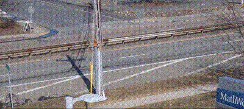
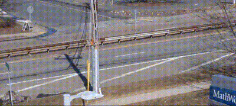

# Project: Detecting Cars in a Noisy Video
This is my final project solution for the Image Processing for Engineering and Science Specialization.

## Methodology
The code implements the following steps:

### Enhancing the video
The goal of this task is preprocess the video by removing the noise from the frames.
- Accumulates subsequent frames to create an average background.
- Converts the average background to grayscale (Remove noise using a 2D median filter).

### Car Segmentation
- Converts the frame to grayscale.
- Calculates the absolute difference between the frame and the background.
- Segments cars in the difference image using thresholding and morphological operations.

### Bounding Box Generation
- Analyzes connected components (regions) in the segmentation mask.
- Filters detections based on area to eliminate small objects (not likely cars).
- Draws red bounding boxes around remaining large objects (assumed cars) on the original frame.

### Output Video Creation
- Creates a new video writer with the same frame rate as the input video.
- Iterates through all frames, performing segmentation and bounding box drawing if necessary.
- Writes the processed frame (with or without bounding boxes) to the output video.

## Result
The original video: 

The output video:

